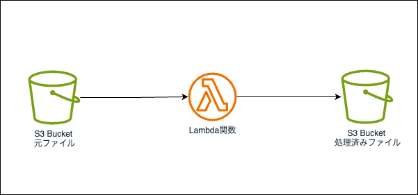

# LambdaのS3トリガーのサンプル

## 概要

LambdaのS3トリガーのサンプル  
S3にファイルがアップロードされたら、Lambdaが起動してファイルをダウンロードして、ファイルに日付を追記して、別のS3バケットにアップロードする。

## 構成

[](./doc/s3-lambda-trigger.drawio.png)

## デプロイ

1. infra/dev/variables.tfvarsを作成する
    1. 以下の内容を記述する
        ```tfvars
        env = "dev"
        aws_account = "xxxxxxxxxxxx"
        aws_access_key = "xxxxxxxxxxxxxxxxxxxx"
        aws_secret_key = "xxxxxxxxxxxxxxxxxxxxxxxxxxxxxxxxxxxxxxxx"
        ``` 
2. `infra/dev`ディレクトリに移動する
3. `terraform init`を実行する
4. `terraform apply -var-file=variables.tfvars`を実行する

## 動作確認

1. イベント通知用のS3バケットにファイルをアップロードする
2. 処理済みファイル用のS3バケットにファイルがアップロードされていることを確認する
    1. ダウンロードして、ファイル名に日付が追記されていることを確認する

## リソース削除

1. `infra/dev`ディレクトリに移動する
2. `terraform destroy -var-file=variables.tfvars`を実行する
